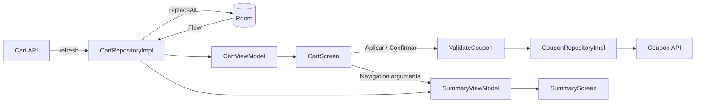

<h1 align="center">
  <a href="https://github.com/pedidosya">
    
  </a>
  <br>
  Carrito de compras Android
</h1>

Aplicación Android de referencia para un flujo de compra con catálogo remoto, caché offline-first, validación de cupones y resumen final. La solución utiliza Kotlin y Jetpack Compose, mantiene Room como fuente local de verdad y separa presentación, dominio y datos en un único módulo `:app`.

## Funcionalidades

- Lista del carrito con estados `Loading`, `Error` y `Success` modelados mediante tipos sellados.
- Lectura inmediata desde Room y actualización transparente desde la red.
- Reintento cuando la primera carga falla sin datos locales.
- Pull-to-refresh sin ocultar el contenido almacenado.
- Validación remota de cupones con resultados tipados: válido, inválido, inactivo o error del servicio.
- Descuento limitado a la categoría indicada por el cupón; `all` aplica a todo el carrito.
- Confirmación sin cupón, reutilización de un cupón ya validado y validación al confirmar un código todavía no aplicado.
- Pantalla de resumen con detalle de productos, porcentaje nominal del cupón y total final.

## Arquitectura

La aplicación sigue una variante pragmática de MVVM con separación por capas:

```text
UI (Compose + ViewModel + StateFlow)
              ↓
Domain (models + repository contracts + use cases)
              ↓
Data (Retrofit + Room + repository implementations)
```



### Decisiones principales

| Tema | Decisión | Motivo |
| --- | --- | --- |
| Fuente de verdad | Room para los ítems del carrito | La UI observa un único `Flow`; la red actualiza la base local y nunca renderiza directamente. |
| Cupones | Validación siempre remota, sin caché | Evita aceptar promociones vencidas o inexistentes cuando no hay conexión. |
| Inyección de dependencias | `AppContainer` manual | El grafo es pequeño y no requiere Hilt o Koin. |
| Estado de UI | `sealed interface` + `StateFlow` | Obliga a manejar los estados y resultados de forma exhaustiva. |
| Cálculo de descuento | Caso de uso puro `CalculateTotals` | Centraliza categorías, redondeo y total final fuera de la UI. |
| Navegación | Argumentos primitivos del cupón | Summary reconstruye los totales desde Room; no transporta objetos de dominio por el back stack. |
| Redondeo | `BigDecimal` con `HALF_UP` dentro del caso de uso | Mantiene resultados deterministas y testeables. |

## Estructura del proyecto

```text
app/src/main/java/com/pedidosya/kata/
├── App.kt
├── MainActivity.kt
├── di/                 # AppContainer y grafo manual
├── data/
│   ├── local/          # Room: database, DAO y entidades
│   ├── mapper/         # DTO ↔ entity ↔ domain
│   ├── remote/         # Retrofit APIs y DTOs
│   └── repository/     # Implementaciones de repositorios
├── domain/
│   ├── model/          # CartItem, Coupon, CartTotals y resultados sellados
│   ├── repository/     # Contratos de datos
│   └── usecase/        # CalculateTotals y ValidateCoupon
└── ui/
    ├── cart/            # Estado, eventos, ViewModel y pantalla del carrito
    ├── navigation/      # Rutas y NavHost
    ├── summary/         # Estado, ViewModel y pantalla de resumen
    └── theme/           # Tema Compose
```

## Stack técnico

| Área | Tecnología |
| --- | --- |
| Lenguaje | Kotlin 2.0.21, JVM 17 |
| UI | Jetpack Compose, Material 3 |
| Estado | Coroutines, Flow y StateFlow |
| Navegación | Navigation Compose |
| Red | Retrofit, OkHttp y kotlinx.serialization |
| Persistencia | Room con KSP |
| Imágenes | Coil Compose |
| Pruebas | JUnit 4, MockK, Turbine y kotlinx-coroutines-test |
| Android | minSdk 24, targetSdk 35, compileSdk 35 |

## Servicios remotos

| Servicio | Endpoint |
| --- | --- |
| Carrito | `GET https://dummyjson.com/c/9518-ea8d-4660-afd8` |
| Cupones | `GET https://dummyjson.com/c/8e56-250c-4cd8-9c5a` |

La app necesita conexión para refrescar el carrito y validar cupones. Sin conexión, los ítems almacenados siguen disponibles; la validación de cupones informa un error y no aplica un descuento local.

## Ejecutar el proyecto

### Requisitos

- Android Studio con soporte para AGP 8.6.1.
- JDK 17.
- Android SDK 35.

### Compilar

```bash
./gradlew :app:assembleDebug
```

El APK se genera en:

```text
app/build/outputs/apk/debug/app-debug.apk
```

También se puede abrir el proyecto en Android Studio y ejecutar la configuración `app` sobre un emulador o dispositivo con API 24 o superior.

## Pruebas

Ejecutar toda la suite JVM:

```bash
./gradlew :app:testDebugUnitTest --rerun-tasks
```

Ejecutar únicamente las pruebas principales del carrito:

```bash
./gradlew :app:testDebugUnitTest \
  --tests "com.pedidosya.kata.ui.cart.CartViewModelTest" \
  --rerun-tasks
```

Estado verificado al cerrar el cambio:

| Evidencia | Resultado |
| --- | ---: |
| Requisitos | 9/9 |
| Escenarios | 21/21 |
| Pruebas unitarias | 46/46 |
| `CartViewModelTest` | 14/14 |
| `assembleDebug` | PASS |
| Bloqueos críticos | 0 |

El alcance actual prioriza pruebas JVM de dominio, repositorios y ViewModels. Se conserva el test instrumentado de ejemplo del scaffold, pero no se añadieron pruebas instrumentadas de Room ni pruebas de comportamiento de Compose.

## Estrategia de desarrollo por fases

El trabajo se realizó con Specification-Driven Development (SDD), artefactos OpenSpec y TDD estricto. Cada fase produjo una salida verificable antes de habilitar la siguiente.

| Fase SDD | Objetivo | Resultado |
| --- | --- | --- |
| Explore | Revisar el scaffold, los endpoints y los vacíos técnicos | Mapa inicial de dependencias, riesgos y alcance. |
| Proposal | Definir problema, alcance y criterios de éxito | Flujo offline-first, validación remota y resumen de compra aprobados. |
| Spec | Convertir decisiones en requisitos observables | 9 requisitos y 21 escenarios Given/When/Then. |
| Design | Resolver arquitectura, contratos y flujo de datos | MVVM por capas, Room como fuente de verdad y DI manual. |
| Tasks | Dividir el cambio en unidades revisables | Fases de implementación con pruebas y rollback definidos. |
| Apply | Implementar cada unidad con TDD | Ciclos RED → GREEN → TRIANGULATE → REFACTOR. |
| Verify | Contrastar código, pruebas, diseño y especificaciones | PASS: 9/9 requisitos, 21/21 escenarios y 46/46 pruebas. |
| Sync | Promover las especificaciones verificadas | Specs canónicas publicadas en `openspec/specs/`. |
| Archive | Cerrar el cambio sin perder trazabilidad | Evidencia completa preservada en `openspec/changes/archive/`. |

### Fases de implementación

1. **Foundation:** dependencias, infraestructura de pruebas, tema y contenedor de DI.
2. **Domain:** modelos, contratos de repositorio y cálculo puro de totales.
3. **Cart data:** DTOs, Retrofit, Room, mappers y repositorio offline-first.
4. **Cart UI:** estado sellado, ViewModel, pantalla y navegación inicial.
5. **Coupon data:** API, repositorio remoto y caso de uso de validación.
6. **Apply/Confirm:** validación, preview, gating y eventos de navegación.
7. **Summary:** reconstrucción de totales desde Room y pantalla final.
8. **Pull-to-refresh:** actualización manual con contenido cacheado visible.
9. **Remediation:** pruebas de primera carga, carrito vacío y fallo de refresh; corrección de la confirmación con cupón todavía no aplicado.

### Estrategia de entrega y revisión

- El cambio se dividió en una cadena `stacked-to-main` de 13 PRs.
- Cada unidad de código quedó por debajo del presupuesto de 400 líneas modificadas.
- Las pruebas se incluyeron en el mismo commit que el comportamiento validado.
- La cadena se fusionó en orden para que cada PR mostrara únicamente su unidad de trabajo.
- El archivo histórico de OpenSpec utilizó una excepción explícita de tamaño porque dividirlo habría fragmentado la evidencia inmutable del ciclo SDD.

La trazabilidad completa está disponible en:

- Especificaciones vigentes: [`openspec/specs/`](openspec/specs/)
- Cambio archivado: [`openspec/changes/archive/2026-09-18-shopping-cart/`](openspec/changes/archive/2026-09-18-shopping-cart/)
- Requerimiento original: [`docs/requerimiento.md`](docs/requerimiento.md)
- Issue de entrega: [#1](https://github.com/santimattius/android-shopping-cart-kata/issues/1)
- Cadena de PRs: [issue #1, sección «Stacked PR chain»](https://github.com/santimattius/android-shopping-cart-kata/issues/1)

## Límites conocidos

La verificación final dejó estas observaciones no bloqueantes:

- La UI del carrito no renderiza `imageUrl`, aunque el modelo conserva el campo.
- No existe una fila separada para subtotal; se muestra el total resultante.
- No se muestra un indicador específico de datos potencialmente desactualizados después de un refresh fallido; el requisito obligatorio de conservar el caché sí está cubierto.
- El manifest conserva el atributo `package`; AGP utiliza `namespace` desde Gradle y muestra una advertencia no bloqueante.

Estas decisiones y sus evidencias permanecen documentadas en el reporte de verificación archivado.
